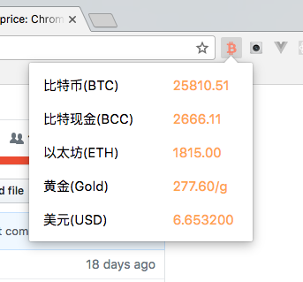

## 比特币价格，Chrome插件
> 正如你看到的，这个chrome插件主要是显示 比特币、黄金、美元对RMB的比例
> 如果你对区块链、前端技术，以及投资感兴趣，那就一起参与这个项目吧！！！

## 如何使用该插件
打开Chrome，更多工具（more tools），扩展（extensions），加载解压的扩展（load unpacked extension），选择bitcoin-price/src目录

## 如何写一个chrome插件
首先可以看360翻译的文档，上面有大量的demo，http://open.chrome.360.cn/extension_dev/background_pages.html
